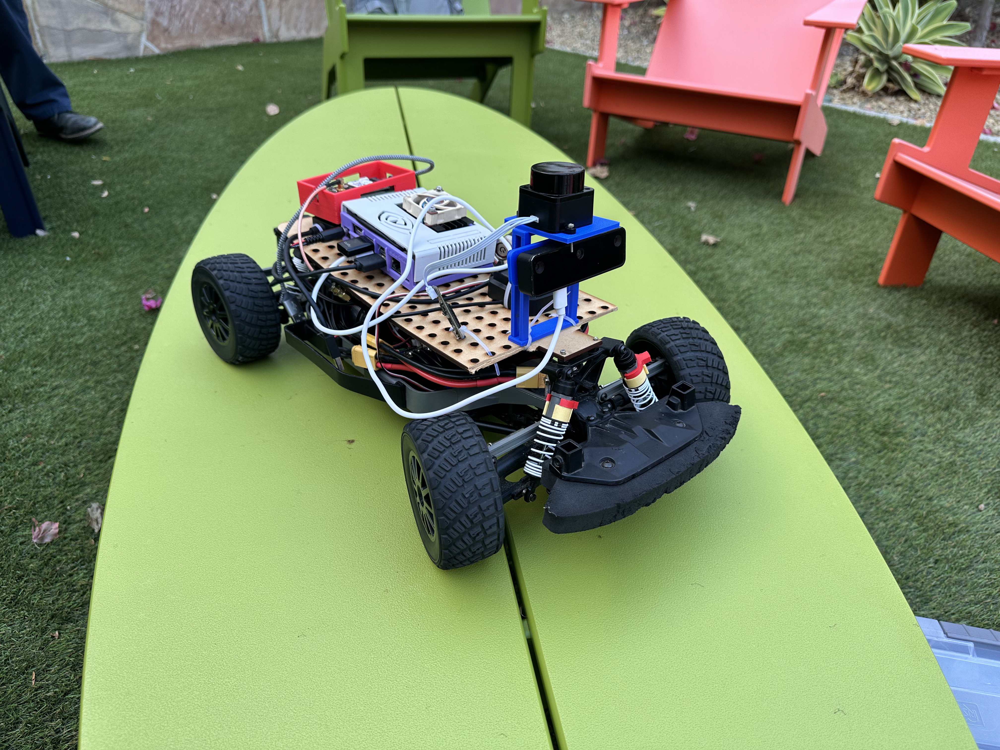
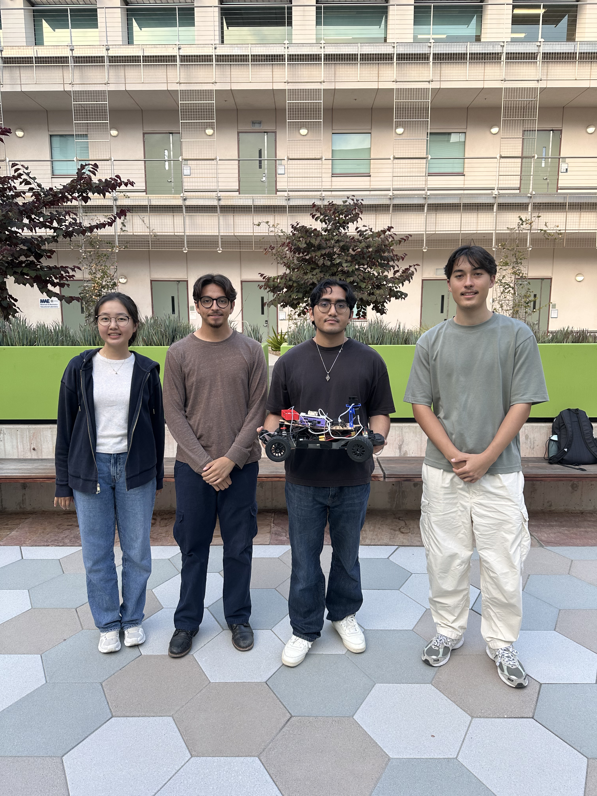
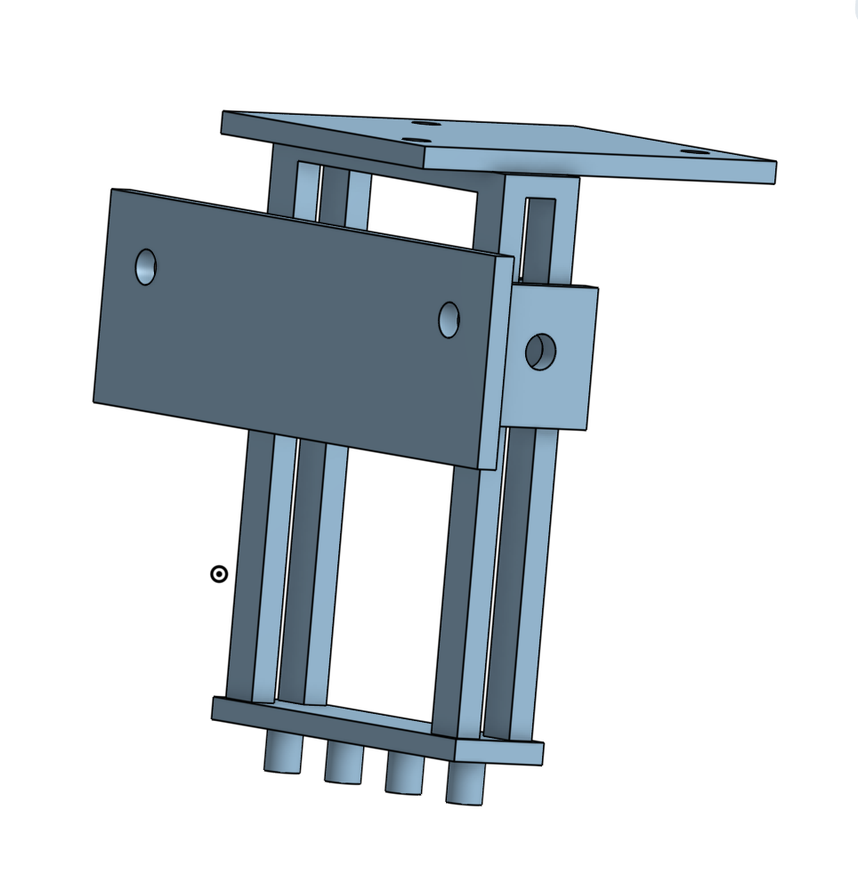
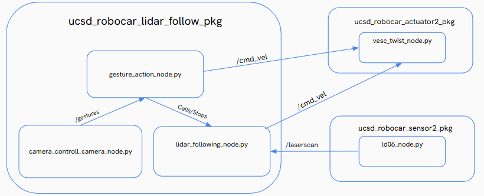

# Autonomous Service Robocar

  

---

  
### ECE MAE 148 Final Project

### Team 2 - Summer 2025

  

---

## Table of Contents
1. [Team Members](#team-members)
2. [Abstract](#abstract)
3. [What We Promised](#what-we-promised)
   - [Must Have](#must-have)
   - [Nice to Have](#nice-to-have)
4. [Accomplishments](#accomplishments)
5. [Demonstration](#demonstration)
6. [Challenges](#challenges)
7. [Robot Design](#robot-design)
8. [Electrical Diagram](#electrical-diagram)
9. [Software Diagram](#software-diagram)
10. [Acknowledgements](#acknowledgements)

---

## Team Members
- Cecilia Lee - Mechanical Engineering: Controls and Robotics - <cdl006@ucsd.edu>
- Yusuf Maung - Electrical Engineering - <ymaung@ucsd.edu>
- Orlando Villagrana - Aerospace Engineering - <ovillagrana@ucsd.edu>
- Dylan Williams - Computer Engineering - <dywilliams@ucsd.edu>

  

 Left to right: Cecilia, Orlando, Yusuf, Dylan 

---

## Abstract
The goal of our project is to program a helper robot that is capable of following and leading a person to or from a destination depending on the situation. The robot should recognize a person and follow them around while looking out for hand signals that correspond to different actions. These actions include movements such as starting, stopping, and turning that allow the robot to follow or lead a person. The motivation behind this project steams from real-world issues. For example, caregivers of dementia patients can improve the safety of their loved ones by making sure that they can always make their way back home with the assistance of our Service Robocar. 

---

## What We Promised

### Must Have
- When the intended person starts walking, the robot can start following one meter behind them as they walk
- The robot can detect different gestures that the person makes
- The robot can perform an action based on the gesture that was detected

### Nice to Have
-   The robot can stop following and start leading the person when the correct gesture is detected
-   While leading, the robot can reach a set home destination

---

## Accomplishments
- Trained hand signals Roboflow models and succesfully loaded them to the OAKD Lite camera, allowing detection of three different gestures
  - Closed-fist hand signal causes the robot to stop following
  - Open-hand signal causes the robot to start following
  - A V-sign (peace sign) signal causes the robot to rotate 180 degrees
- Created a package with ROS2 that uses a LIDAR to gauge distance and allow the robot to follow a person from around one meter away
  - Robot will stop as intended when too close or too far from person   

---

## Demonstration

  <a href="videos/follow_openhand.mp4"> Open Hand Sign </a>

  <a href="videos/sit_closedhand.mp4"> Closed Hand Sign </a>

  <a href="videos/trick_vsign.mp4"> V-Sign </a>

---

## Challenges
- Inconsistencies with gesture detection
  - Sometimes the wrong signal was interpreted
  - Sometimes the robot would take a while to detect a signal 
- Inconsistencies with tracking and following
  - Sometimes the robot would "see" another closer object and begin to follow that instead
- We were unable to successfully implement a working "leading" feature as intended 

---

## Robot Design

  

The majority of our electronics sit on the bed of the RoboCar chassis beneath a wooden mount plate that we laser cut. Above the plate rests more electronics like our GPS board, NVIDIA Jetson Nano, and our LIDAR and OAKD Lite camera screwed onto our 3D-printed mount (image above). The case for our Jetson Nano can be found below.

  <a href="https://www.thingiverse.com/thing:3518410"> Jetson Nano Case </a>

---

## Software Diagram

  

---

## Acknowledgements

Thank you to Professor Jack and to Tutors Alex and Jose for making this course as smooth, engaging, and valuable as possible!

---
